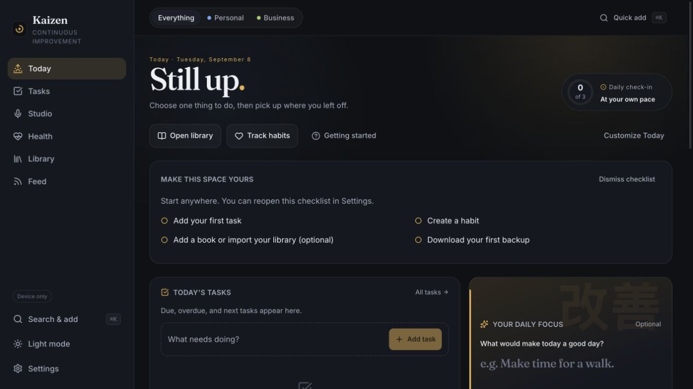
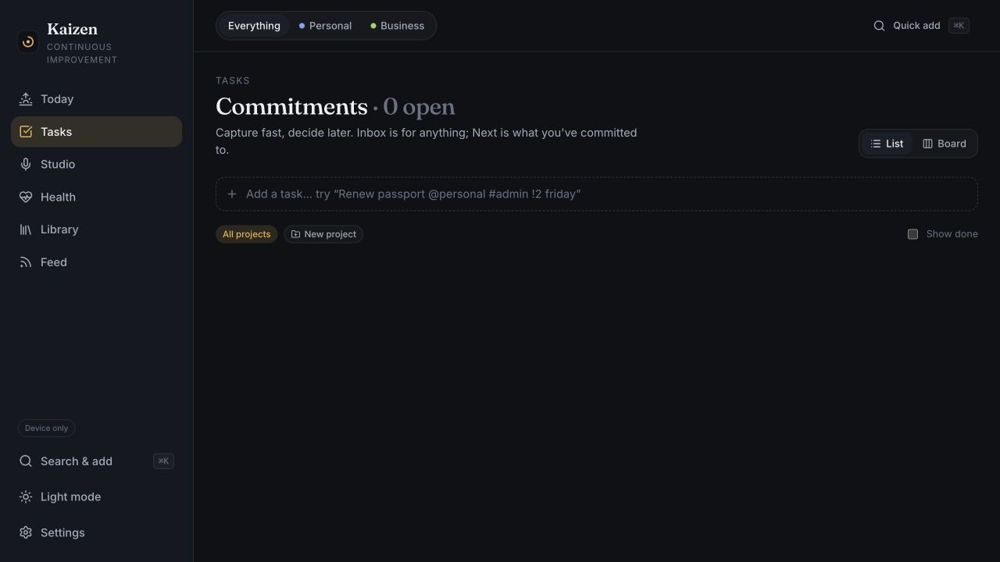
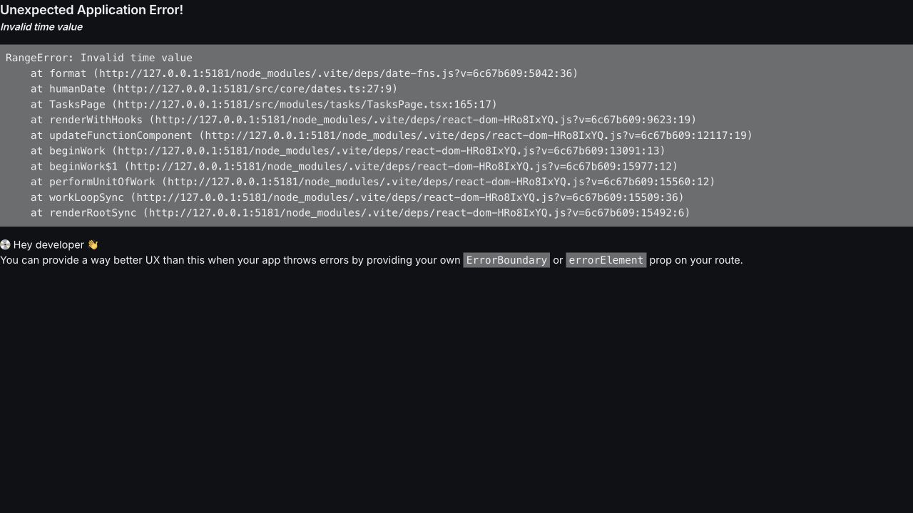
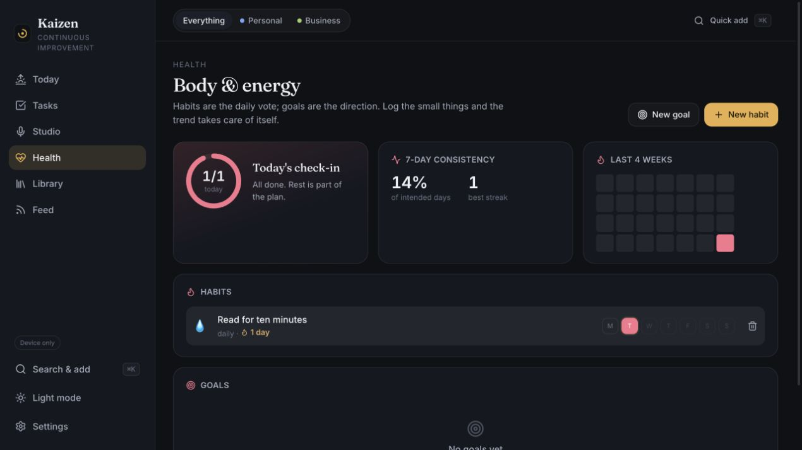
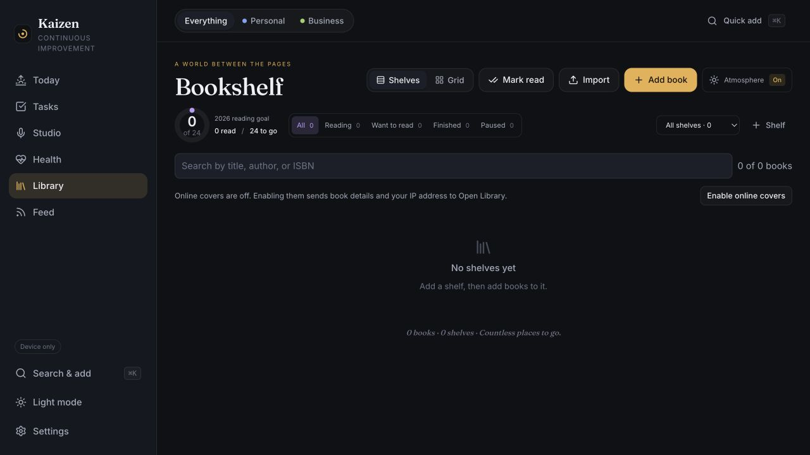
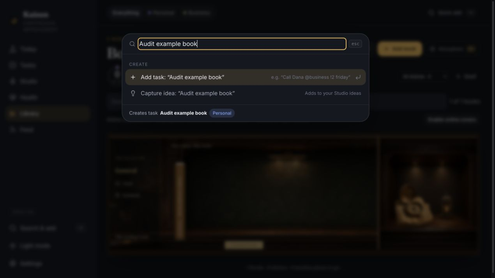
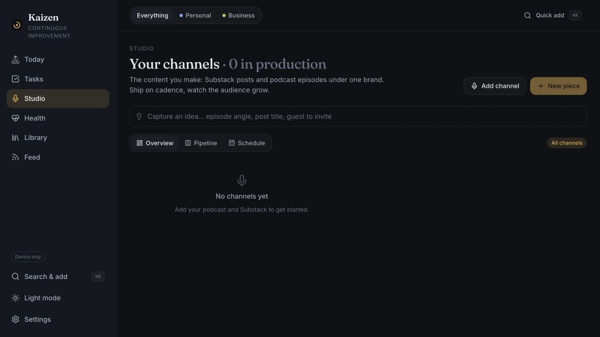
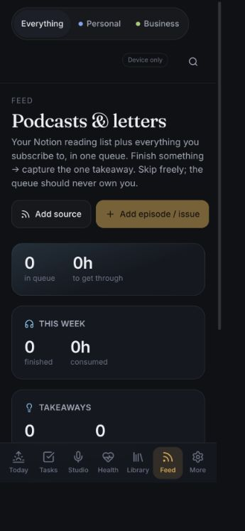
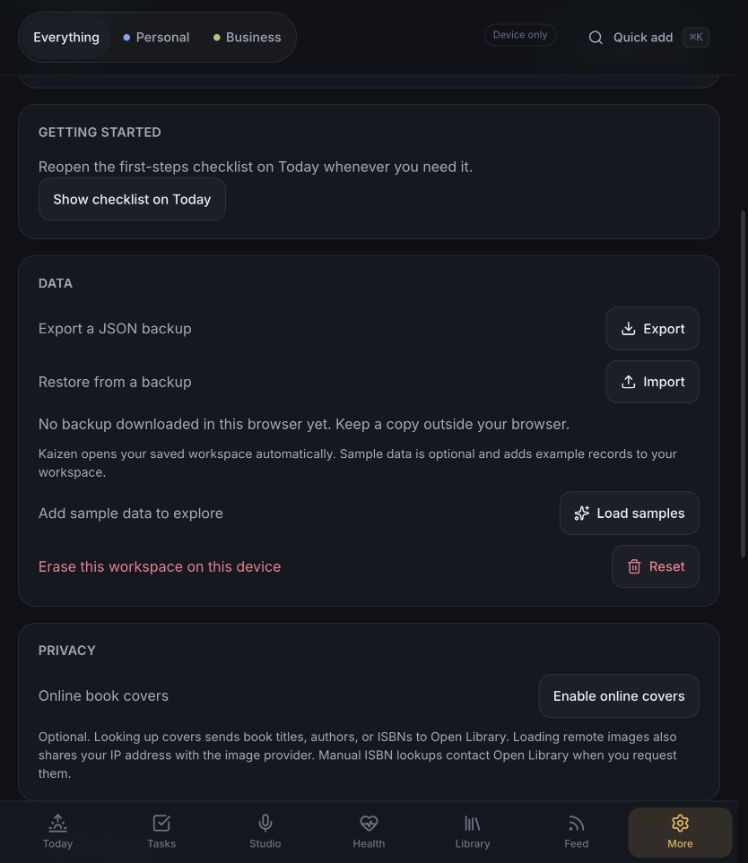

# Kaizen application review — September 8, 2026

Kaizen has a coherent visual identity, fast basic capture, and useful separation between browser storage and cloud mode. The next improvement pass should focus on reliable input handling, keyboard access, and making everyday actions easier to discover.

## Review metadata

| Field | Value |
| --- | --- |
| Review ID | REV-2026-09-08-APP |
| Date | 2026-09-08 |
| Category | Application UX, accessibility, reliability, and performance |
| Areas | Today, Tasks, Health, Library, command palette, Studio, Feed, Settings |
| Keywords | onboarding, date validation, keyboard, search, habits, mobile, backup, bundle size |
| Reviewed revision | [61b1008](https://github.com/calcuttin/Project-Kaizen/commit/61b1008c5d7dd0329017f8adf7f7d304417827f5) |
| Review method | AI-assisted browser interaction, screenshot inspection, source inspection, and local checks |
| AI contribution | Codex performed the review and drafted the findings and proposed fixes |
| Human contribution | The project maintainer requested the review and authorized public publication and roadmap tracking |
| Validation status | Agent-reproduced observations and source/visual findings; independent human reproduction is not recorded |
| Tracking issue | [#1 — roadmap tracker](https://github.com/calcuttin/Project-Kaizen/issues/1) |
| Delivery status | Findings recorded; implementation progress lives in the linked GitHub issues |

This is an AI-assisted development record, not a claim of independent human validation or a complete security/accessibility audit. Suggestions may change after contributor review. Each issue records evidence and acceptance criteria; a merged fix should link its validation back to the finding.

## Scope and evidence

Reviewed the current local checkout in the Codex in-app browser, using a separate origin at port 5181 in device-only mode with bundled imports disabled. Created only synthetic records: one task, one habit, and one book. Inspected Today, Tasks, Health, Library, the command palette, Studio, Feed, and Settings. Checked Feed with a 390 × 844 browser viewport override; reset that override afterward. Other screenshots use the browser's default viewport, which changed during the review.

All screenshots below were captured during this run, saved, and reopened for inspection. The date-error screenshot is intentionally a captured failure. Source inspection supplements the visual and interaction evidence. No application source was changed.

## Priorities

| Priority | Improvement | Evidence | Suggested completion criterion |
| --- | --- | --- | --- |
| P1 | Validate parsed dates before rendering or saving | Step 3, reproduced crash | Invalid dates produce inline feedback; the draft and navigation remain usable |
| P1 | Fix command palette focus containment and keyboard controls | Step 6 plus keyboard verification | Tab stays inside the dialog, Escape always closes it, focus returns to its trigger |
| P2 | Give task completion a clear end state | Step 2 | Completing the last open task displays confirmation and a Show completed action |
| P2 | Make global search retrieve existing records | Step 6 | Searching an existing book or task returns an openable record before creation actions |
| P2 | Make habit progress reflect when tracking began | Step 4 | New habits do not count days before creation as misses; explain weekly targets |
| P2 | Simplify first-use and phone layouts | Steps 1, 5, 7, 8 | The useful next action comes before empty metrics and advanced controls |
| P2 | Complete semantic accessibility across reusable controls | Steps 2, 4, 6 plus source | Project filters and board cards work with a keyboard; habit buttons announce date and state |
| P3 | Split the initial JavaScript bundle by route | Build output and registry | Visiting Today does not load every route's implementation; measure improvement before setting a size budget |

## Linked roadmap issues

These issues are the live implementation record. The observations below remain a dated snapshot.

| Priority | Work item | Issue |
| --- | --- | --- |
| P1 | Validate quick-add dates and recover gracefully from route errors | [#2](https://github.com/calcuttin/Project-Kaizen/issues/2) |
| P1 | Keep keyboard focus inside the command palette and restore Escape behavior | [#3](https://github.com/calcuttin/Project-Kaizen/issues/3) |
| P2 | Show a completed-task empty state and make Show done consistent across views | [#4](https://github.com/calcuttin/Project-Kaizen/issues/4) |
| P2 | Find existing workspace records through global search | [#5](https://github.com/calcuttin/Project-Kaizen/issues/5) |
| P2 | Make habit consistency account for tracking start and weekly targets | [#6](https://github.com/calcuttin/Project-Kaizen/issues/6) |
| P2 | Edit and archive habits without losing their history | [#7](https://github.com/calcuttin/Project-Kaizen/issues/7) |
| P2 | Make project filters, task board cards, and habit controls accessible | [#8](https://github.com/calcuttin/Project-Kaizen/issues/8) |
| P2 | Prioritize useful first actions on Today, Library, and Studio | [#9](https://github.com/calcuttin/Project-Kaizen/issues/9) |
| P2 | Put the Feed queue before empty statistics on phones | [#10](https://github.com/calcuttin/Project-Kaizen/issues/10) |
| P3 | Add a dismissible backup reminder and separate destructive settings | [#11](https://github.com/calcuttin/Project-Kaizen/issues/11) |
| P3 | Measure initial loading and split route-specific JavaScript | [#12](https://github.com/calcuttin/Project-Kaizen/issues/12) |

## Flow review

### 1. Today / onboarding — usable, too many competing entry points

The warm heading, consistent navigation, optional focus field, and actionable setup checklist are good foundations. At the captured desktop height, shortcuts and the setup panel push the task area toward the bottom of the screen. A first-time user sees several ways to start before the central daily action.

Make task capture the first prominent action. Reduce the checklist to a compact progress row, with the remaining steps expandable. Offer a lightweight choice of useful areas, using the existing Customize Today capability. Keep optional journaling separate from a sense that the user has failed an overall completion score.

Accessibility: secondary copy and very small status labels deserve measured contrast and zoom checks; this is a visual risk, not a verified contrast failure.

### 2. Tasks / capture and complete — core action works, ending is unclear

Created “Review weekly plan” using Enter, then completed it using the checkbox. The open count correctly changed from 1 to 0, but the list became entirely blank. Reloading preserved the completed task state.

The empty-state condition checks whether any tasks exist before filtering out completed groups. Compute the displayed collection first. Show “All caught up” with a Show completed action when records exist but none remain visible. Keep “No tasks yet” for an actually empty workspace.

Source: [TasksPage.tsx](https://github.com/calcuttin/Project-Kaizen/blob/61b1008c5d7dd0329017f8adf7f7d304417827f5/src/modules/tasks/TasksPage.tsx#L105).

Source-confirmed related issue: Show done is displayed for Board too, but its value is passed only to TaskList. Either apply it to Board or limit the control to the relevant view.

Accessibility: clickable project spans have no native button behavior; board cards are draggable divs without tab stops or keyboard handlers. Use native buttons for filters, a keyboard-openable card action, and a status control that does not require dragging. The task editor already provides a status selector, so expose it consistently.

Source: [project filters](https://github.com/calcuttin/Project-Kaizen/blob/61b1008c5d7dd0329017f8adf7f7d304417827f5/src/modules/tasks/TasksPage.tsx#L78), [board cards](https://github.com/calcuttin/Project-Kaizen/blob/61b1008c5d7dd0329017f8adf7f7d304417827f5/src/modules/tasks/TasksPage.tsx#L180), [shared Chip](https://github.com/calcuttin/Project-Kaizen/blob/61b1008c5d7dd0329017f8adf7f7d304417827f5/src/components/ui/index.tsx#L58).

### 3. Tasks / malformed date — broken

Reproduction: in Tasks quick add, type “Review plan 2026-13-01”. Before submission, the application replaces the entire shell with “Unexpected Application Error! / Invalid time value”. Reloading recovers because this draft was not saved.

The parser accepts any string matching YYYY-MM-DD, then the preview formats it as a real date. Validate calendar dates in the parser, use defensive date formatting for restored or imported data, and add a route error screen with a recovery action. Preserve unrecognized tokens as text or offer an inline correction rather than dropping the draft.

Source: [parse.ts](https://github.com/calcuttin/Project-Kaizen/blob/61b1008c5d7dd0329017f8adf7f7d304417827f5/src/core/parse.ts#L43), [dates.ts](https://github.com/calcuttin/Project-Kaizen/blob/61b1008c5d7dd0329017f8adf7f7d304417827f5/src/core/dates.ts#L43), [router configuration](https://github.com/calcuttin/Project-Kaizen/blob/61b1008c5d7dd0329017f8adf7f7d304417827f5/src/app/App.tsx#L16).

Add regression coverage for impossible months and days, valid leap days, partially typed dates, and invalid dates arriving from stored data.

### 4. Health / create and check in — works, scoring needs context

Created a daily habit and checked it off today. The immediate “1/1 today” and “All done” response is clear. However, the same screen reports only 14% consistency on the first day of tracking.

The score always considers seven days and does not use the habit creation date. Count only eligible days since tracking began, or label the measure explicitly as a rolling total with an onboarding explanation. For habits scheduled a few times weekly, distinguish weekly target achievement from a consecutive daily streak; the current streak helper always breaks on a missed calendar day.

Also add Edit and Archive controls. The visible habit row currently offers logging and deletion, but no way to correct a name, target, or frequency while preserving history.

Source: [weeklyCompletion and habitStreak](https://github.com/calcuttin/Project-Kaizen/blob/61b1008c5d7dd0329017f8adf7f7d304417827f5/src/modules/health/store.ts#L92), [habit row](https://github.com/calcuttin/Project-Kaizen/blob/61b1008c5d7dd0329017f8adf7f7d304417827f5/src/modules/health/HealthPage.tsx#L67).

Accessibility: day buttons are 26 × 26 CSS pixels and use repeated single-letter labels. Increase their touch area and announce the full date, habit name, and checked state. Keep the color treatment as a supplement to that state.

### 5. Library / first book — works, empty-state instructions are misleading

The Add book and Import actions are visible, and the privacy explanation for online covers is unusually clear. I successfully added a book with Shelf set to None; it appeared under Unshelved.

The empty state says “Add a shelf, then add books to it,” even though that prerequisite is unnecessary. Replace it with “Add your first book” and “Import a library”; shelves can be optional organization. Hide or deemphasize Mark read, empty filters, and atmosphere controls until there are books to act on. Let users choose a reading goal rather than presenting 24 as an already agreed target.

The book was created successfully; ISBN lookup, scanning, and file import were not exercised.

### 6. Global search / retrieving a book — expectation mismatch and keyboard defect

After creating “Audit example book”, I searched its exact title through Search & add. The palette offered Add task and Capture idea, with no result for the existing book.

Add search over stored tasks, books, saved items, and publishing pieces, grouped by area. Rank existing matches before creation actions. A smaller interim fix is to rename the entry point to “Commands & quick add”.

Source: [command construction](https://github.com/calcuttin/Project-Kaizen/blob/61b1008c5d7dd0329017f8adf7f7d304417827f5/src/components/CommandPalette.tsx#L37).

Additional keyboard verification later on Settings: open Quick add, press Shift+Tab. Focus moves from the palette input to the background More navigation link while the palette remains open. Escape then does nothing. Returning focus to the input makes Escape work again.

Use the existing native dialog pattern or an equivalent properly managed modal: contain focus, make the background inert, restore trigger focus, and handle Escape at the dialog level. Expose the active result and selection changes to assistive technology.

Source: [palette rendering](https://github.com/calcuttin/Project-Kaizen/blob/61b1008c5d7dd0329017f8adf7f7d304417827f5/src/components/CommandPalette.tsx#L65).

### 7. Studio / first-use entry — understandable, weak next-action hierarchy

The overview explains the channel prerequisite, and Add channel is available. But the visually emphasized New piece action is disabled while Add channel receives less emphasis.

Promote “Add your first channel” in the empty state and make it the primary action until a channel exists. Explain whether setup is manual organization or a service connection. Retain quick idea capture for users who have not organized a channel yet.

Only the entry screen was reviewed; channel creation, scheduling, and publishing-related workflows were not completed.

### 8. Feed / phone layout — navigation available, queue buried

The layout reflows and navigation stays available, but three large zero-value metric cards precede the queue controls and empty-state guidance. At phone width, the main queue is below the first screen.

Put the queue or “Add your first source” panel first. Collapse summary statistics into a compact row or reveal them after content exists. Make Add source the primary initial action instead of visually emphasizing the disabled Add episode / issue button. Review whether seven bottom navigation destinations should be reduced, with secondary areas behind More.

Source creation and content consumption were not exercised; the screenshot supports layout findings only.

### 9. Settings / data and privacy — clear foundation

Export, restore, sample data, and destructive reset have readable explanations. The last-backup message and explicit description of cover requests help users understand where their data goes.

Improve the long-term experience with a dismissible stale-backup reminder for device-only users. Consider separating Reset into its own danger section so it is farther from routine data actions. Preserve the existing explicit privacy language.

Export/import round trips and destructive actions were not performed. These recommendations concern the visible controls and information layout, not a claim that backup or reset is faulty.

## Engineering verification

- Unit tests: 14 files, 36 tests passed.
- Production build and TypeScript build: passed.
- Database schema/type fingerprint check: passed.
- Public-source check: passed; its own output correctly limits the scope of this scan.
- Build warning: main JavaScript output is 818.59 kB minified / 237.40 kB gzip. The module registry statically imports all areas. Consider lazy route pages and review Today widget dependencies so route splitting actually reduces initial loading. This is a bundle-size observation, not a measured performance failure.

Existing CI also defines browser and database jobs. I did not rerun the full Playwright suites or database jobs in this review. Passing unit tests do not cover the manually reproduced UI defects above.

## Limits and suggested implementation order

Cloud authentication, live multi-device sync, account deletion, external services, large imports, screen-reader behavior, precise contrast ratios, and a full responsive matrix were not verified. This is not a comprehensive security or accessibility certification.

1. Fix date validation and route recovery; add focused regression tests.
2. Fix palette focus and reusable interactive semantics.
3. Fix task empty states and Show done consistency.
4. Add record search and correct habit scoring/management.
5. Simplify onboarding and phone layouts, then measure route loading and split the bundle where useful.

This report records the original review. Publication adds the archive index, template, and linked roadmap; application behavior is unchanged.
